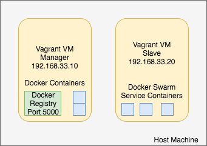

# Advanced Docker

We cover deployment, composing, and starting a service on a cluster using Docker Swarm.


### Deploy

This example shows you how to create deploy a nodejs container to a private repository. 
A server can pull from the private repostory and get the latest code.

##### Setup

Create a vagrant machine and install docker on it.
```
vagrant init ubuntu/xenial64
```
Modify the vagrant file to change the private ip `192.168.33.10`  
Run the container and ssh into it and install docker.
```
vagrant up
vagrant ssh
sudo apt-get update -y
sudo apt-get install -y docker.io
sudo usermod -aG docker $(whoami)
```
Logout from shell and relogin to use docker. Run `docker run hello-world` to verify if docker is correctly working.
###### Note: You might face issues if you are using trusty instead of xenial
##### Registry
Making the repository run in insecure mode so that its accessible from out side.
Create daemon.json file
```
cat <<EOT >> daemon.json
{
 "insecure-registries" : ["192.168.33.10:5000"]
}
EOT
```
Move the dameon.json to correct folder and restart docker service.  
```
sudo mv daemon.json /etc/docker/daemon.json
sudo service docker restart
```


Start a private registery on port 5000.

```
docker run -d -p 5000:5000 --restart=always --name registry registry:2
```

More information about setting up a [TLS-secured registery](https://docs.docker.com/registry/deploying/), which is remotely accessible.

##### Node App and Dockerfile

Can get app from `git clone https://github.com/CSC-DevOps/App.git`

Note how Dockerfile uses "COPY" command to place contents from local filesystem into container.

```
FROM    centos:centos6

# Enable EPEL for Node.js
RUN     rpm -Uvh http://download.fedoraproject.org/pub/epel/6/i386/epel-release-6-8.noarch.rpm
# Install Node.js and npm
RUN     yum install -y npm

# Bundle app source
COPY . /src
# Install app dependencies
RUN cd /src; npm install

EXPOSE  8080
CMD ["node", "/src/main.js", "8080"]
```

##### Build and test 

Build a container for a node js app.

```
cd App
docker build -t ncsu-app .
docker run -p 50100:8080 -d --name app ncsu-app
docker logs <containerid>
curl -i localhost:50100
```

##### Deploy to registry

If successful, can deploy to a private registery.

```
docker tag ncsu-app 192.168.33.10:5000/ncsu:latest
docker push 192.168.33.10:5000/ncsu:latest
```
You can check images in registry using the following command
```
curl -X GET http://192.168.33.10:5000/v2/_catalog
```

#### Docker Swarm Cluster
##### Architecture
  
Run the following command to initiate a cluster

```
docker swarm init --advertise-addr 192.168.33.10
```
This will give you a command to add more nodes to this cluster. Copy that command: 
Command should look like this.
```
docker swarm join \
    --token SWMTKN-1-0otmrb2ufyj8w7qltgajyjth4niapgkh93brcll4bc4wc8ceqn-6mqdppru3adp6a56o9rgnzpar \
    192.168.33.10:2377
```

Now lets start another vagrant machine (with private ip `192.168.33.20`).   
Use the commands mentioned above to install docker on it.(No need to run registry)  
We will refer to this new VM as Slave and the first one as Manager.

Adding information about insecure registry  
Create daemon.json file
```
cat <<EOT >> daemon.json
{
 "insecure-registries" : ["192.168.33.10:5000"]
}
EOT
```
Move the dameon.json to correct folder and restart docker service.  
```
sudo mv daemon.json /etc/docker/daemon.json
sudo service docker restart
```
Run the copied command(swarm join) on the Slave machine. This adds the slave to our cluster.

Run the following commands on the manager
```
docker node ls 
```
##### Creating A Service

Lets run our app as a service on this cluster. 
```
docker service create --replicas 1 --name node-app -p 3000:8080 --update-delay 10s --update-parallelism 1 192.168.33.10:5000/ncsu:latest
```
There are several important parameters in the above coommand. 
- `--name` sets name of the service.
- `--update-delay` sets delay between updating each container.
- `--update-parallelism` sets how many containers to update at the same time.
- Last parameter is the name of the docker image we want to use

Run the following command to ger more details about the serivice.
```
docker service inspect node-app --pretty
```

Let us scale our service.
```
docker service scale node-app=10
```
Go to a web browser and repeatedly reload `http://192.168.33.10:3000/` you should see different id's.  
This means the Swarm cluster is automatically performing load balancing for us.

##### Rolling Update
On the Manager Node
Modify App/main.js and change the server to return `Hola` instead of Hello.
Let us now build and push the new image to registry

```
cd App
docker build -t ncsu-app .
docker tag ncsu-app 192.168.33.10:5000/ncsu:v2
docker push 192.168.33.10:5000/ncsu:v2
```

Service Update. Docker Swarm will pull from registery, perform a rolling update.

```
docker service update --image 192.168.33.10:5000/ncsu:v2 node-app  
```

Now if you go and make repeated calls to `http://192.168.33.10:3000/`.  
You will slowly start seeing all the Hello's slowing getting changed to Hola's  
*Our Rolling update is under progress with no down time.*

### Orchestration

There are several tools that help assist in combining several containers under one configuration scheme.

* http://decking.io/
* [Docker Swarm](https://docs.docker.com/engine/swarm/)
* [fig](http://www.fig.sh/)
* [Docker Compose](https://docs.docker.com/compose/)

Other tools work on a larger scale, such as http://kubernetes.io/

### Other

Cleanup

`docker images -q --filter "dangling=true" | xargs docker rmi`

